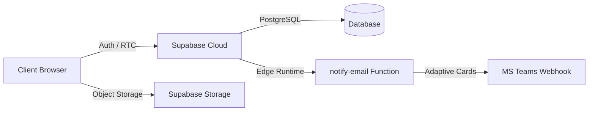

# 🎫 Sistema de Tickets de Soporte - Push HR Spa

[](https://pushhr.cl)
[](https://vitejs.dev/)
[](https://supabase.com/)
[](https://www.microsoft.com/)

Una solución **state-of-the-art** de nivel corporativo para la orquestación y resolución de incidentes técnicos en **Push HR Spa**. Diseñada bajo principios de **Software Resilience**, **Real-time Sync** y **Zero Trust Security**.

---

## 🏗️ Technical Architecture & Ecosystem

El sistema se basa en una arquitectura de **Single Page Application (SPA)** desacoplada, utilizando servicios serverless de alta disponibilidad.

### Data Flow Diagram


### Database Schema (Entity Relationship)
El esquema PostgreSQL está optimizado para integridad referencial y auditoría:
- **`profiles`**: Gestión de roles (Admin, Técnico, Usuario) y metadata de SSO.
- **`tickets`**: CORE - Seguimiento de estados, prioridades y asignaciones.
- **`messages`**: Hilo de comunicación con soporte para mensajes privados.
- **`history`**: Audit trail inmutable de cada cambio de estado o asignación.
- **`notifications`**: Sistema interno de alertas web en tiempo real.

---

## 🚀 Key Professional Features

### 🖥️ High-Fidelity UI/UX
- **Glassmorphism Design System**: Interfaz con efectos de desenfoque de fondo y transparencias dinámicas.
- **Real-time Synchronization Engine**: Sincronización bidireccional instantánea mediante **Change Data Capture (CDC)** sobre el puerto 5432.
- **Optimistic UI Updates**: Respuesta inmediata del frontend que sincroniza en segundo plano, mejorando la latencia percibida a <100ms.

### 🔗 Teams Webhook Integration (Polished)
Notificaciones enriquecidas mediante **Message Cards** que incluyen:
- **Priority Heatmap**: Codificación de colores visual para respuesta rápida.
- **Smart Deep Linking**: Generación dinámica de `ticketUrl` basada en el origen de despliegue.
- **Rich Payload**: Desglosado técnico con ID de ticket correlativo y metadatos de usuario.

### 🔐 Security & Compliance
- **Row-Level Security (RLS)**: Políticas granulares en SQL que impiden el acceso a datos fuera del scope del rol.
- **Microsoft 365 OAuth 2.0**: Autenticación empresarial mediante Entra ID.
- **Domain White-listing**: Firewall de aplicación que restringe accesos externos al dominio corporativo.

---

## 🛠️ Tech Stack Deep-Dive

| Layer | Technologies |
| :--- | :--- |
| **Frontend Foundation** | React 18, Vite, ES6+ |
| **Global State Management** | Multi-Context API Pattern (Auth, Data, Toast, Notif) |
| **Database Engine** | PostgreSQL (Supabase Managed) |
| **Real-time Layer** | Supabase Realtime (WebSockets) |
| **Serverless Logic** | Deno-based Edge Functions |
| **Analytical Visualization** | Chart.js & React-chartjs-2 integration |

---

## 🔧 Deployment & Infrastructure Setup

### Prerequisites
- Node.js LTS (>=18.20.0)
- Supabase CLI (para despliegue de Edge Functions)

### Environment Configuration
Configure el archivo `.env` con las siguientes claves críticas:

```env
VITE_SUPABASE_URL=https://[YOUR-PROJECT-ID].supabase.co
VITE_SUPABASE_ANON_KEY=[YOUR-SERVICE-ROLE-OR-ANON-KEY]
```

### Edge Function Secrets
Para activar las notificaciones de Teams, ejecute en la consola de Supabase:
```bash
supabase secrets set TEAMS_WEBHOOK_URL="https://outlook.office.com/webhook/..."
```

### Database Initialization
Asegúrese de ejecutar los scripts en la carpeta `supabase/migrations` para habilitar el motor de Realtime y las políticas RLS necesarias.

---

## 📄 Licencia y Credenciales
Este software es de propiedad intelectual de **Push HR Spa**. Queda prohibida la reproducción parcial o total sin consentimiento explícito del equipo de IT.

Desarrollado con **excelencia técnica** para optimizar la productividad dePush HR. 🚀
