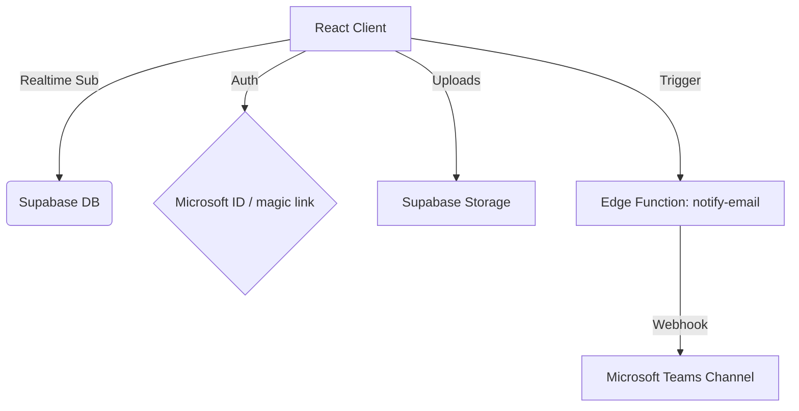

# 🎫 Sistema de Tickets - Push HR Spa

[](https://vitejs.dev/)
[](https://reactjs.org/)
[](https://supabase.com/)
[](https://www.microsoft.com/en-us/microsoft-365/microsoft-teams/group-chat-software)

Una plataforma **Enterprise-Grade** de alto rendimiento diseñada para la gestión de soporte técnico interno en **Push HR Spa**. Optimizada para la velocidad, seguridad y eficiencia operativa.

---

## ✨ Características de Nivel Premium

### 🔗 Notificaciones Integradas con MS Teams
- **Alertas en Tiempo Real**: Notificaciones instantáneas en canales de Teams para nuevos tickets, mensajes y asignaciones.
- **Adaptive Cards**: Interfaz visual enriquecida con estados por color (Crítico/Alto en rojo, Medio en naranja).
- **Deep Linking**: Botones de acción directa que llevan al usuario específicamente al ticket correspondiente.
- **Identificación Completa**: Visualización de nombre, correo y prioridad directamente en el chat de Teams.

### 🔐 Seguridad Corporativa & IT
- **Dominio Verificado**: Acceso restringido exclusivamente a colaboradores con correo `@pushhr.cl`.
- **RBAC Avanzado**: Tres niveles de acceso (Admin, Técnico, Usuario) con políticas de seguridad a nivel de fila (RLS) en base de datos.
- **Autenticación Microsoft**: Integración nativa con Microsoft 365 para un inicio de sesión seguro y empresarial.

### 📂 Gestión de Archivos y Evidencia
- **Cloud Storage**: Sistema de carga de archivos integrado con Supabase Storage para capturas de pantalla y documentos técnicos.
- **Visualización In-App**: Previsualización instantánea de adjuntos dentro del flujo del ticket.

---

## 🏗️ Arquitectura del Sistema



---

## 🛠️ Stack Tecnológico

| Componente | Tecnología |
| :--- | :--- |
| **Frontend** | React 18 + Vite (Ultrarápido) |
| **Backend** | Supabase (Serverless Infrastructure) |
| **Base de Datos** | PostgreSQL con RLS policies |
| **Notificaciones** | Microsoft Teams Webhooks V2 |
| **Dashboard** | Chart.js para métricas visuales |
| **Estilos** | CSS Moderno (Glassmorphism & Flexbox) |

---

## 🚀 Guía de Instalación Rápida

1. **Clonar e Instalar**
   ```bash
   git clone [URL-DEL-REPOSITORIO]
   npm install
   ```

2. **Variables de Entorno (.env)**
   ```env
   VITE_SUPABASE_URL=tu_url_supabase
   VITE_SUPABASE_ANON_KEY=tu_anon_key
   ```

3. **Configurar Teams (Backend)**
   Asegúrate de configurar el secreto `TEAMS_WEBHOOK_URL` en tu instancia de Supabase:
   ```bash
   supabase secrets set TEAMS_WEBHOOK_URL=tu_url_webhook
   ```

4. **Desplegar**
   ```bash
   npm run dev
   ```

---

## 🤝 Soporte y Contribución
Desarrollado con excelencia para el equipo de **Push HR Spa**. Para reportar fallos, utiliza el propio sistema de tickets integrado en la plataforma. 🚀
